<picture>
  <source media="(prefers-color-scheme: dark)" srcset="./assets/header-dark.svg">
  <source media="(prefers-color-scheme: light)" srcset="./assets/header-light.svg">
  
</picture>

<p align="center">
  <a href="mailto:kswook30@gmail.com"></a>
  
  
  
</p>

<p align="center"><samp>“안 되는 이유보다 '되는 방법'을 먼저 찾자”</samp></p>

### <samp>~/about</samp>

```python
class SeungwookKim:
    role       = "AI Agent Developer"
    background = "Full-stack Developer · 4y 7m · Java / Spring"
    now        = "AI Human 7기"
    focus      = ["ai-agents", "llm", "speech", "vision"]
    contact    = "kswook30@gmail.com"
```

KT · LG · CJ · 공공기관 시스템을 <b>4년 7개월간 풀스택 개발자</b>로 구축하고 고도화했어요.
지금은 그 경험 위에서 <b>AI Agent 개발자</b>로 넘어가는 중이에요. 모델을 학습·평가·배포하고, 그 모델을 실제 서비스 흐름에 붙이는 일에 집중합니다.

### <samp>~/now</samp>

<!-- ✏️ 수시로 직접 고쳐 쓰는 칸 -->
- 🤖 **Building** — AI Human 7기 메인 프로젝트 · AI Agent
- 📚 **Studying** — LLM 에이전트 설계 · MCP · 멀티 에이전트
- 🎯 **Goal** — 풀스택 경험을 살린 AI Agent 개발자

### <samp>~/stack</samp>

<!-- AI 먼저, 그다음 풀스택 · 도구 순서 (분류 라벨 없이 한 흐름으로) -->
<p>
  
  
  
  
  
  
  
  
  
  
  
  
  
  
  
  
  
  
  
  
  
  
  
</p>

<code>EXAONE 3.5</code> <code>Whisper</code> <code>Qwen3-TTS</code> <code>ko-sroberta</code> <code>CLIP</code> <code>Seq2Seq</code> <code>CNN</code> <code>librosa</code> <code>MyBatis</code> <code>JSP</code> <code>Oracle</code> <code>Highcharts</code>

### <samp>~/projects</samp> <sub>newest first · auto-updated</sub>

<!--PROJECTS:START-->
| Project | Description | Lang | Started | Last push |
| :-- | :-- | :-: | :-: | :-: |
| [**ChefEar_porject_1**](https://github.com/seungwook-kim/ChefEar_porject_1) | 1차 메인 프로젝트 |  | 2026.08.24 | 2026.08.24 |
| [**ai-music-genre-classification**](https://github.com/seungwook-kim/ai-music-genre-classification) | 음악 장르 분류 |  | 2026.08.06 | 2026.08.06 |
| [**transformer**](https://github.com/seungwook-kim/transformer) | transformer_실습 |  | 2026.08.02 | 2026.08.02 |
| [**mini_Project_part_1**](https://github.com/seungwook-kim/mini_Project_part_1) | 미니프로젝트_1_분류_MNIST_CNN_배포 / 미니프로젝트_2_회귀_자전거_수요 |  | 2026.07.22 | 2026.07.22 |
| [**streamlit**](https://github.com/seungwook-kim/streamlit) | Gemini API 기반 Q&A 챗봇 Streamlit 앱 |  | 2026.07.16 | 2026.07.16 |
<!--PROJECTS:END-->

<sub>공개 저장소를 GitHub Actions가 매일 최신순으로 다시 정렬해요 · <a href="https://github.com/seungwook-kim?tab=repositories">all repositories →</a></sub>

### <samp>~/journey</samp>

<!-- ✏️ data/journey.json 맨 위에 한 줄 추가하면 Actions가 그림을 다시 그려요 -->
<picture>
  <source media="(prefers-color-scheme: dark)" srcset="./assets/journey-dark.svg">
  <source media="(prefers-color-scheme: light)" srcset="./assets/journey-light.svg">
  
</picture>

### <samp>~/activity</samp>

<picture>
  <source media="(prefers-color-scheme: dark)" srcset="https://raw.githubusercontent.com/seungwook-kim/seungwook-kim/output/snake-dark.svg">
  <source media="(prefers-color-scheme: light)" srcset="https://raw.githubusercontent.com/seungwook-kim/seungwook-kim/output/snake-light.svg">
  
</picture>

<details>
<summary><samp>~/bookmarks</samp> — 자주 여는 문서</summary>
<br>

| | Links |
| :-- | :-- |
| 🔥 **Train** | [PyTorch](https://docs.pytorch.org/docs/stable/index.html) · [Transformers](https://huggingface.co/docs/transformers) · [PEFT](https://huggingface.co/docs/peft) · [Datasets](https://huggingface.co/docs/datasets) |
| 🚀 **Serve** | [Streamlit](https://docs.streamlit.io) · [Gradio](https://www.gradio.app/docs) · [HF Spaces](https://huggingface.co/docs/hub/spaces) · [Supabase](https://supabase.com/docs) |
| 📄 **Read** | [HF Papers](https://huggingface.co/papers) · [arXiv cs.CL](https://arxiv.org/list/cs.CL/recent) · [arXiv eess.AS](https://arxiv.org/list/eess.AS/recent) |
| ⚙️ **GitHub** | [Actions](https://docs.github.com/actions) · [Writing on GitHub](https://docs.github.com/get-started/writing-on-github) · [My stars](https://github.com/seungwook-kim?tab=stars) |

</details>

<p align="center"><samp>$ exit 0 · thanks for stopping by</samp></p>
