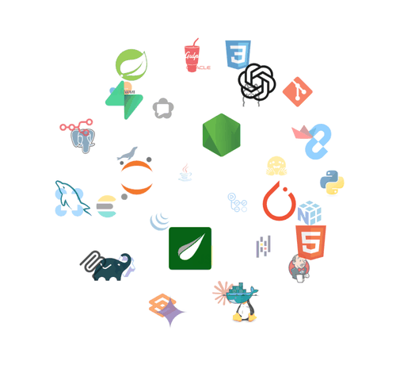

<picture>
  <source media="(prefers-color-scheme: dark)" srcset="./assets/header-dark.svg">
  <source media="(prefers-color-scheme: light)" srcset="./assets/header-light.svg">
  
</picture>

<p align="center">
  <a href="mailto:kswook30@gmail.com"></a>
  
</p>

<p align="center"><i>“안 되는 이유보다 <b>'되는 방법'</b>을 먼저 찾자”</i></p>

### <samp>~/about</samp>

```python
class SeungwookKim:
    role    = "AI Agent Developer"
    now     = "AI Human 7기"
    focus   = ["ai-agents", "llm", "speech", "vision"]
    contact = "kswook30@gmail.com"
```

듣고, 판단하고, 행동하는 <b>AI Agent</b>를 만들고 있어요. 모델을 학습·평가·배포하는 것에서 끝내지 않고, 에이전트가 실제 서비스 흐름 안에서 동작하도록 붙이는 일에 집중합니다.

<sub>그 기반에는 4년여간 Java 백엔드·웹 실무에서 쌓은 API·DB 설계 경험이 있어요.</sub>

### <samp>~/now</samp>

<!-- ✏️ 수시로 직접 고쳐 쓰는 칸 -->
- 🤖 **Building** — 메인 프로젝트 · AI Agent
- 📚 **Studying** — LLM 에이전트 설계 · MCP · 멀티 에이전트
- 🎯 **Goal** — 실제 서비스에서 동작하는 AI Agent 만들기

### <samp>~/projects</samp> <sub>newest first · auto-updated</sub>

<!--PROJECTS:START-->
| Project | Description · Topics | Started |
| :-- | :-- | :-: |
| [**ChefEar**](https://github.com/seungwook-kim/ChefEar) <sub>`archived`</sub> | 요리 중 음성으로 레시피를 안내하는 AI 음성 에이전트 · STT/TTS 파인튜닝 · LLM 의도 분류<br><sub>`gradio` `huggingface` `korean` `llm` `qlora` `qwen3-tts` `speech-recognition` `streamlit` `supabase` `text-to-speech` `voice-assistant` `webrtc` `whisper`</sub> | 2026.08.24 |
| [**transformer**](https://github.com/seungwook-kim/transformer) | Transformer 실습 모음 · 감성 분석 · Seq2Seq 번역 · CLIP 멀티모달 검색 · 이미지 캡셔닝<br><sub>`attention` `blip` `clip` `huggingface` `image-captioning` `konlpy` `model-optimization` `multimodal` `nllb` `nlp` `pytorch` `seq2seq` `streamlit` `transformer`</sub> | 2026.08.02 |
<!--PROJECTS:END-->

<sub>공개 저장소를 GitHub Actions가 매일 최신순으로 다시 정렬해요 · <a href="https://github.com/seungwook-kim?tab=repositories">all repositories →</a></sub>

### <samp>~/journey</samp>

<!-- ✏️ data/journey.json 맨 위에 한 줄 추가하면 Actions가 그림을 다시 그려요 -->
<picture>
  <source media="(prefers-color-scheme: dark)" srcset="./assets/journey-dark.svg">
  <source media="(prefers-color-scheme: light)" srcset="./assets/journey-light.svg">
  
</picture>

<details>
<summary><sub>이전 경력 · Java 풀스택 실무 사례 (2020.10 – 2025.04)</sub></summary>
<br>

<sub>㈜테크돔 SI 개발. 고객사 폐쇄망·보안 규정 때문에 실무 코드는 외부로 반출할 수 없어, 어떤 문제를 어떻게 해결했는지 사례로만 정리했어요.</sub>

**가락시장 리뉴얼** <sub>2025.01 – 2025.04 · 공공 · 풀스택, 시스템 현대화 · DB 설계</sub><br>
<code>Java 12</code> <code>Oracle</code> <code>Nexacro</code> <code>REST API</code>

- **노후 실행 환경** → Java 7 기반 환경을 Java 12로 업그레이드해 보안성과 처리 성능 강화
- **화면 리뉴얼** → Nexacro로 화면을 개편하고 서버 통신 비즈니스 로직 설계
- **리뉴얼용 데이터 구조** → 신규 DB 스키마를 설계하고 대량 데이터 처리 로직 구현

**KT 미디어인증 · KT CAKE 고도화 1·2차** <sub>2024.09 – 2024.12 · 서버 안정화 · 통계 고도화 전담</sub><br>
<code>Java</code> <code>Oracle</code> <code>REST API</code> <code>Highcharts</code>

- **느린 통계 조회** → 대용량 통계 SQL을 분석해 인덱스 최적화와 로직 수정으로 조회 성능 개선
- **무거운 대시보드** → 데이터 호출 방식을 효율화하고 응답 구조를 경량화해 로딩 속도 개선
- **기본 차트로 표현 불가** → Highcharts 세부 옵션을 직접 수정해 서비스에 맞는 차트 구현
- **운영 안정성** → 서버 로그 분석으로 메모리 누수 지점을 찾고, 권한별 메뉴 접근 제어 추가

**KT 온라인 마케팅 시스템 고도화** <sub>2024.01 – 2024.08 · 실행 환경 최적화 · 권한/통계/검색 개발</sub><br>
<code>Java</code> <code>Spring Boot</code> <code>PostgreSQL</code> <code>Node.js</code> <code>Gradle</code> <code>Gulp</code>

- **번거로운 외장 WAS 배포** → Spring Boot 내장 WAS 기반 단독 실행 구조로 전환해 배포·운영 효율화
- **흩어진 권한 검증** → 권한 관리 페이지를 새로 만들고 서버 단 권한 검증 로직을 공통화
- **Java 업그레이드 후 빌드 호환성** → Node.js·Gulp(v3 → v4)를 올리고 빌드 스크립트 전면 수정
- **통계·검색 요구사항** → 통계 쿼리 튜닝, 통계·검색 페이지 구현과 UI 리뉴얼

**KT MEIN(미디어인증) 고도화 · KT CAKE** <sub>2022.05 – 2023.12 · 대시보드 · 인증 API 보안</sub><br>
<code>Java</code> <code>JSP</code> <code>jQuery</code> <code>JPA</code> <code>MS-SQL</code> <code>Elasticsearch</code> <code>Highcharts</code>

- **대용량 로그 검색 성능** → Elasticsearch를 도입해 로그 데이터 변환과 실시간 검색 성능 개선
- **흩어진 관리 지표** → Highcharts 기반 통합 관리자 대시보드 구축
- **개인정보 보호** → 공통 암복호화 모듈을 개발하고 웹/앱 인증 API 고도화

**CJ 균주 관리 시스템** <sub>2022.04 – 2022.05 · 키오스크 프린터 제어 1인 전담</sub><br>
<code>Java</code> <code>ZPL</code>

- **하드웨어 연동** → ZPL로 키오스크 입력값에 따른 라벨 출력과 커팅을 정밀 제어
- **원격 운영** → 가상 서버 환경에서 프린터 상태 실시간 모니터링과 설정값 조정 로직 개발

**경기아트센터 관리 시스템** <sub>2022.01 – 2022.03 · 공공 · 관리자 페이지</sub><br>
<code>Java</code> <code>JSP</code> <code>jQuery</code> <code>MariaDB</code>

- **권한 관리** → 팀/권한별 메뉴 노출 제어와 접근 로그 관리 페이지 구현
- **운영 기능** → 결제 관리 모듈, 회원가입 승인 프로세스 설계와 화면 개발

**LG 차량관제 시스템 고도화** <sub>2021.06 – 2022.02 · 지도 기반 관제 전담 · 웹 UI 리뉴얼</sub><br>
<code>Java</code> <code>JSP</code> <code>JavaScript</code> <code>jQuery</code> <code>MariaDB</code> <code>아이나비 지도 API</code>

- **지도 API 교체** → 무료 지도 API를 아이나비 지도 API로 마이그레이션 전담, 경로 탐색·위치 표시 로직 재구축
- **실시간 관제** → 서버로 들어오는 GPS 데이터로 차량 위치를 실시간 표시하고 이동 궤적 렌더링
- **지도 데이터 처리 속도** → 위치·파라미터 데이터 호출 DB 로직을 수정해 처리 속도 개선

**KT 보이스봇** <sub>2020.10 – 2021.05 · 음성인식 응답 API</sub><br>
<code>Java</code> <code>REST API</code>

- **음성인식 연동** → 연동 규격서를 작성하고 응답형 REST API 구현
- **상담 시나리오** → 고객센터 시나리오별 비즈니스 로직 연동

</details>

### <samp>~/stack</samp>

<picture>
  <source media="(prefers-color-scheme: dark)" srcset="./assets/stack-globe-dark.gif">
  <source media="(prefers-color-scheme: light)" srcset="./assets/stack-globe-light.gif">
  
</picture>

**Fine-tuning**
- LLM — Kanana-2 1.3B · Qwen3 0.6B
- STT — Whisper large-v3-turbo (QLoRA)
- TTS — Qwen3-TTS 1.7B (LoRA)

**Deploy**
- HF Spaces GPU 백엔드 + Streamlit 프론트 분리
- OpenShift(Kubernetes) 환경 서비스 배포

**Now**
- AI Agent · MCP 서버 개발

<br clear="left">

<code>EXAONE 3.5</code> <code>faster-whisper</code> <code>Transformers</code> <code>PEFT</code> <code>bitsandbytes</code> <code>silero-vad</code> <code>sentence-transformers</code> <code>ko-sroberta</code> <code>CLIP</code> <code>Seq2Seq</code> <code>CNN</code> <code>librosa</code> <code>KoNLPy</code> <code>Langfuse</code> <code>Tavily</code> <code>MyBatis</code> <code>JPA</code>

### <samp>~/activity</samp>

<picture>
  <source media="(prefers-color-scheme: dark)" srcset="https://raw.githubusercontent.com/seungwook-kim/seungwook-kim/output/snake-dark.svg">
  <source media="(prefers-color-scheme: light)" srcset="https://raw.githubusercontent.com/seungwook-kim/seungwook-kim/output/snake-light.svg">
  
</picture>

<details>
<summary><samp>~/bookmarks</samp> — 자주 여는 문서</summary>
<br>

| | Links |
| :-- | :-- |
| 🔥 **Train** | [PyTorch](https://docs.pytorch.org/docs/stable/index.html) · [Transformers](https://huggingface.co/docs/transformers) · [PEFT](https://huggingface.co/docs/peft) · [Datasets](https://huggingface.co/docs/datasets) |
| 🚀 **Serve** | [Streamlit](https://docs.streamlit.io) · [Gradio](https://www.gradio.app/docs) · [HF Spaces](https://huggingface.co/docs/hub/spaces) · [Supabase](https://supabase.com/docs) |
| 📄 **Read** | [HF Papers](https://huggingface.co/papers) · [arXiv cs.CL](https://arxiv.org/list/cs.CL/recent) · [arXiv eess.AS](https://arxiv.org/list/eess.AS/recent) |
| ⚙️ **GitHub** | [Actions](https://docs.github.com/actions) · [Writing on GitHub](https://docs.github.com/get-started/writing-on-github) · [My stars](https://github.com/seungwook-kim?tab=stars) |

</details>

<p align="center"><samp>$ exit 0 · thanks for stopping by</samp></p>
